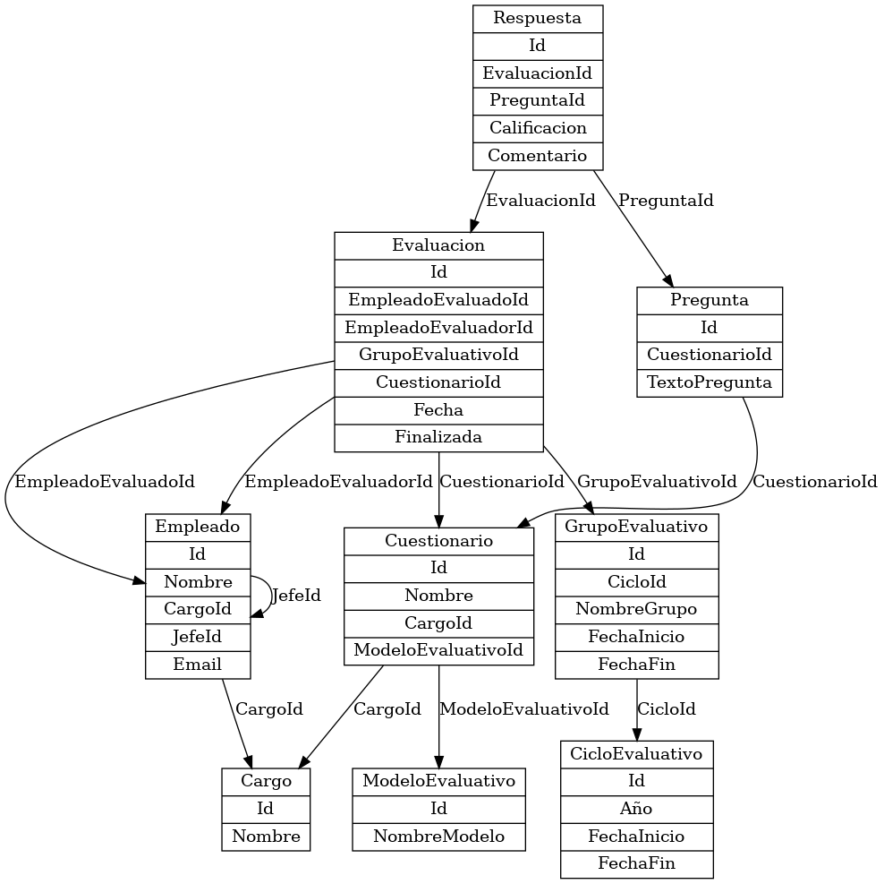

# 🎓 Modelo Evaluativo

Este es un sistema web desarrollado en **ASP.NET Core** que permite la gestión de **modelos evaluativos** dentro de una institución educativa. Incluye funcionalidades CRUD (Crear, Leer, Actualizar y Eliminar) para administrar diferentes modelos evaluativos utilizados en procesos académicos.

## 🚀 Tecnologías utilizadas

- ASP.NET Core 8 (MVC + Razor Pages)
- Entity Framework Core
- MySQL
- Bootstrap (para estilos)
- Swagger (para documentación de API REST)

## 🧩 Estructura del proyecto

- `Controllers/ModeloEvaluativoController.cs`: Controlador principal para la gestión de modelos evaluativos.
- `Models/ModeloEvaluativo.cs`: Modelo de datos con campos como `Nombre` y `Descripcion`.
- `Views/ModeloEvaluativo/`: Contiene las vistas para listar, crear y editar modelos evaluativos.
- `Program.cs`: Configuración inicial de la aplicación y servicios.
- `appsettings.json`: Configuración de cadena de conexión a la base de datos.

## 🧠 Modelo Entidad-Relación (MER)



## 📦 Funcionalidades principales

✅ Listar todos los modelos evaluativos  
✅ Crear un nuevo modelo evaluativo  
✅ Editar un modelo existente  
✅ Eliminar un modelo  
✅ Documentación de API con Swagger  
✅ Página principal de acceso al módulo  

## ⚙️ Requisitos

- [.NET SDK 7.0 o superior](https://dotnet.microsoft.com/en-us/download)
- [MySQL Server](https://dev.mysql.com/downloads/mysql/)
- [Visual Studio]

## 🔧 Configuración inicial

1. Clona este repositorio:
   ```bash
   git clone https://github.com/milton329/ModeloEvaluativoApp.git

2. Configura la cadena de conexión en appsettings.json:
    "ConnectionStrings": {
    "DefaultConnection": "server=localhost;database=EvaluacionesDb;user=root;password=tu_clave"
    }

3. Ejecuta las migraciones (si estás usando EF Core con migraciones):
    dotnet ef database update

4. Corre la aplicación:
   dotnet run


✨ Página principal
Desde la página inicial, puedes acceder al módulo de Modelos Evaluativos para gestionar los registros.